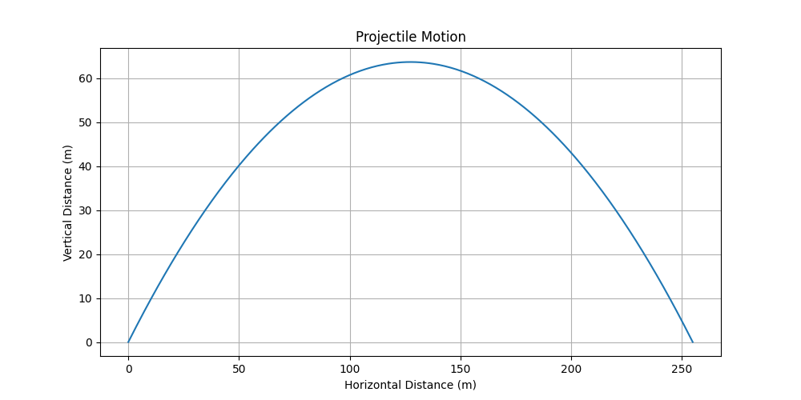

# Projectile Motion Simulation

This is a Python simulation of projectile motion using `numpy` and `matplotlib`.

## Features
- Simulates the trajectory of a projectile.
- Takes user input for initial velocity and angle.
- Calculates and displays the maximum height and horizontal range.
- Plots the trajectory and saves it as an image.

## How to Run
1. Install the required libraries:
   ```bash
   pip install numpy matplotlib
   ``` 

2. Run the script:
   ```bash 
   python projectile_motion.py
   ``` 

3. Enter the initial velocity and angle when prompted.
4. View the plot of the projectile's trajectory and the saved image (`projectile_motion.png`).

## Example Output

